#  Lab: "A Simple Dataflow Pipeline (Python) 2.5" en Google Cloud Platform (GCP)

Este laboratorio forma parte de la Ruta de aprendizaje del Ingeniero de Datos (Data Engineer Learning Path) en Google Cloud  Skills Boost y tiene como objetivo enseñarte a construir un pipeline de procesamiento por lotes de datos utilizando Apache Beam con Python. 

A lo largo del ejercicio, aprenderás a desarrollar y ejecutar este pipeline de forma local, y luego a desplegarlo en Cloud Dataflow, el servicio gestionado de Google para el procesamiento distribuido de datos.

### url: https://www.cloudskillsboost.google/paths/16/course_templates/53/labs/509055

## Laboratorio

## Tarea 1 - Asegúrese de que la API de Dataflow esté habilitada correctamente.
Este paso se hace por precaución, para garantizar que el entorno esté limpio y listo para usar Dataflow sin conflictos. Es una práctica común en entornos de laboratorio o aprendizaje.

Ejecute el siguiente bloque de código en Cloud Shell:
```bash
gcloud services disable dataflow.googleapis.com --force
gcloud services enable dataflow.googleapis.com
```


## Tarea 2 - Preparación.

### - Conexión a la máquina virtual (VM) mediante SSH.

En este laboratorio, ejecutarás todo el código desde una máquina virtual (VM) configurada con los recursos necesarios para el entrenamiento. Esta VM se encuentra preconfigurada en tu proyecto de GCP y te servirá como entorno de desarrollo para construir y desplegar el pipeline.

- Desde la consola de GCP, en el menú de Navegación (Icono del menú de navegación), haga clic en **Compute Engine > Instancias de VM** .

- Localice la línea con la instancia llamada `training-vm` .

- En el extremo derecho, en **Conectar** , haga clic en `SSH` para abrir una terminal directamente en la VM desde tu navegador.


💻 Entorno preconfigurado en la VM training-vm
La máquina virtual training-vm ya viene con todo lo necesario para realizar el laboratorio, incluyendo:

- Python

- pip

- Apache Beam

- Google Cloud SDK


### - Descargar repositorio de código.

Para comenzar a trabajar en el laboratorio, primero debes descargar el repositorio de código que contiene los archivos necesarios para construir el pipeline de datos.

En la terminal SSH de la máquina virtual de entrenamiento, ejecuta el siguiente comando:
    
    git clone https://github.com/GoogleCloudPlatform/training-data-analyst
    
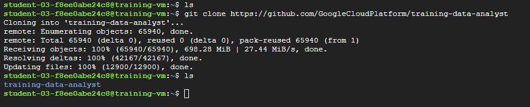

### - Crear un bucket de almacenamiento en Cloud Storage.

Antes de ejecutar cualquier pipeline, asegúrate de que NO existe un bucket en Cloud Storage en tu proyecto.


🔍 ¿Por qué es necesario crear un bucket?

 Google Cloud Dataflow necesita un bucket de Cloud Storage por varias razones:

- **Staging:** guarda archivos temporales como el código del pipeline, librerías y recursos que se usan durante la ejecución.

- **Input:** puede leer archivos fuente (como CSV o JSON) almacenados en la nube.

- **Output:** escribe los resultados del pipeline procesado.

- **Separación entre cómputo y almacenamiento:** el procesamiento ocurre en los workers de Dataflow, mientras que los datos residen en el bucket. Esto permite escalar fácilmente y mantener costos bajos.


Siga estas instrucciones para crear un depósito.

- En la consola, en el menú de navegación , haga clic en **Cloud Storage > Buckets** .

- Haga clic en  **Create bucket**.

- Especifique lo siguiente: `Nombre y Region`  (segun lo que indica el Lab),  y deje las configuraciones restantes como predeterminadas:


- Haga clic en **Crear** .

- haga clic en **Confirmar** .

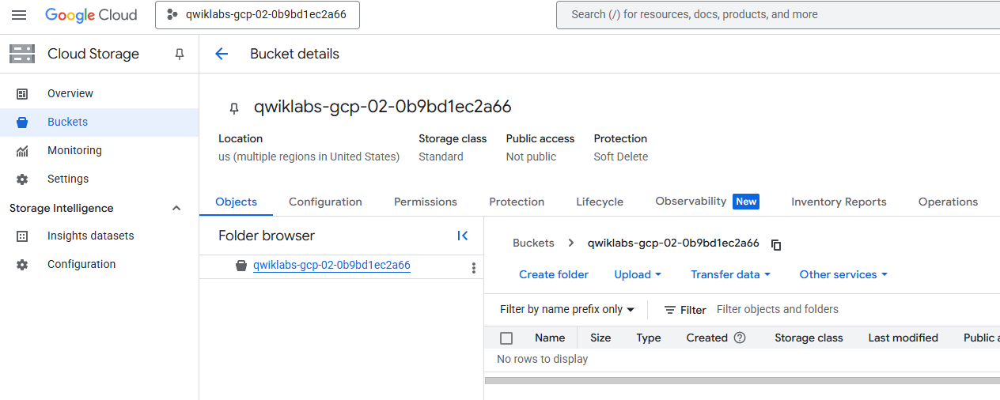

- Desde la terminal SSH de tu VM, `training-vm` ,puedes crear una variable de entorno para referenciar tu bucket fácilmentey verificar que creo correctamente con el comando `echo`:

    ```bash
    BUCKET="PROJECT ID"
    echo $BUCKET
    ```


## Tarea 3 - Filtrado del Pipeline.


En esta etapa del laboratorio, aprenderás a ejecutar una canalización (pipeline) de procesamiento de datos usando Apache Beam y Google Cloud Dataflow. El objetivo es familiarizarte con la estructura de un proyecto de Dataflow, entender cómo funciona el filtrado de datos y observar cómo se ejecuta la lógica desde un archivo Python

- Desde la terminal SSH de tu VM `training-vm` y navega al directorio donde se encuentra el código del pipeline:

    ```
    cd ~/training-data-analyst/courses/data_analysis/lab2/python
    ```
    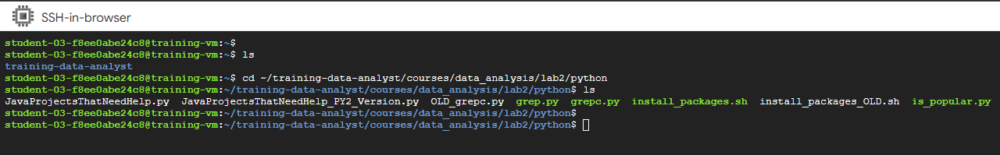
    
- Visualiza el archivo con Nano. 
    ```
    nano grep.py
    ```

    - Presione CTRL+X para salir de Nano.

  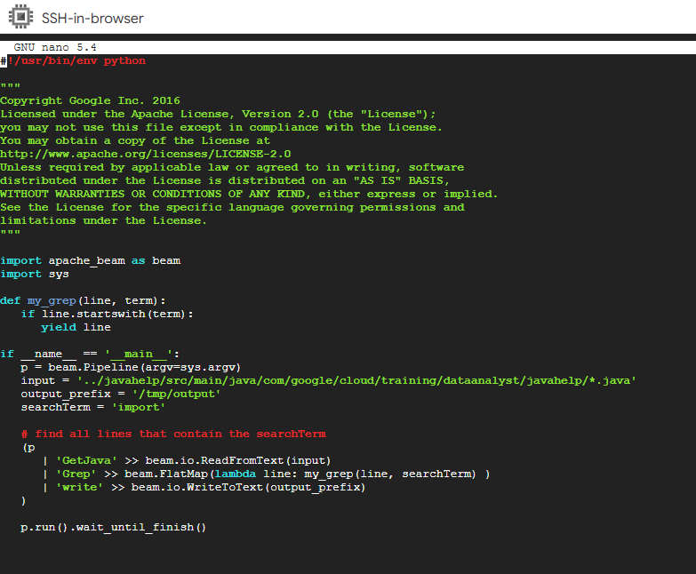


### ¿Qué hace el archivo grep.py?

El archivo grep.py implementa un pipeline escrito en Python usando Apache Beam, que se ejecuta en Dataflow, y emula el comportamiento básico del comando `grep` en Linux/Unix: **buscar líneas de texto que contengan una palabra clave específica.**

#### ¿Puedes responder estas preguntas sobre el archivo grep.py?


- ¿Qué archivos se están leyendo?

     Se están leyendo archivos de texto con extensión `.java` desde una ubicacion en Cloud Storage. La ruta se define mediante el parámetro **--input** al ejecutar el script.

- ¿Cuál es el término de búsqueda?

   La palabra `import`. El pipeline buscara todas las líneas que comiencen con ese término.

- ¿A dónde va la salida?

    Las líneas filtradas se escriben en archivos ubicados en la carpeta **/tmp/output.**
#### Hay tres transformaciones en la tubería:
- ¿Qué hace la primera transformación?

    Lee todas las líneas de texto de los archivos `.java.`

- ¿Qué hace la segunda transformación?

    Filtra las líneas, conservando solo aquellas que comienzan con la palabra `import.`

- ¿De dónde proviene su aporte?

    De la salida de la primera transformación (las líneas leídas del archivo).

- ¿Qué hace con esta entrada?

    Evalúa cada línea y emite solo las que coinciden con el patrón buscado.

- ¿Qué escribe en su salida?

    Una colección de líneas que comienzan con import.

- ¿A dónde va la salida?
    
    Pasa a la tercera transformación, que la guarda en archivos de salida.

- ¿Qué hace la tercera transformación?

     Escribe las líneas filtradas en archivos dentro de la carpeta /tmp/output.


## Tarea 4 - Ejecutar la canalización localmente.

- En la terminal SSH de la máquina virtual de entrenamiento `training-vm` , ejecute localmente grep.py:

    ```bash
    python3 grep.py
    ```
    Nota : ignore la advertencia si la hay.

El archivo de salida será output.txt. Si el tamaño de salida es suficiente, se dividirá en partes separadas con nombres como: output-00000-of-00001.

- Localice el archivo correcto examinando la hora del archivo:
    ```
    ls -al /tmp
    ```
    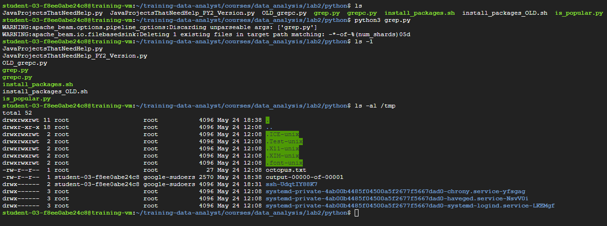
- Examine los archivos de salida.

- Puede reemplazar "-*" a continuación con el sufijo apropiado:

    ```
    cat /tmp/output-*
    ```
    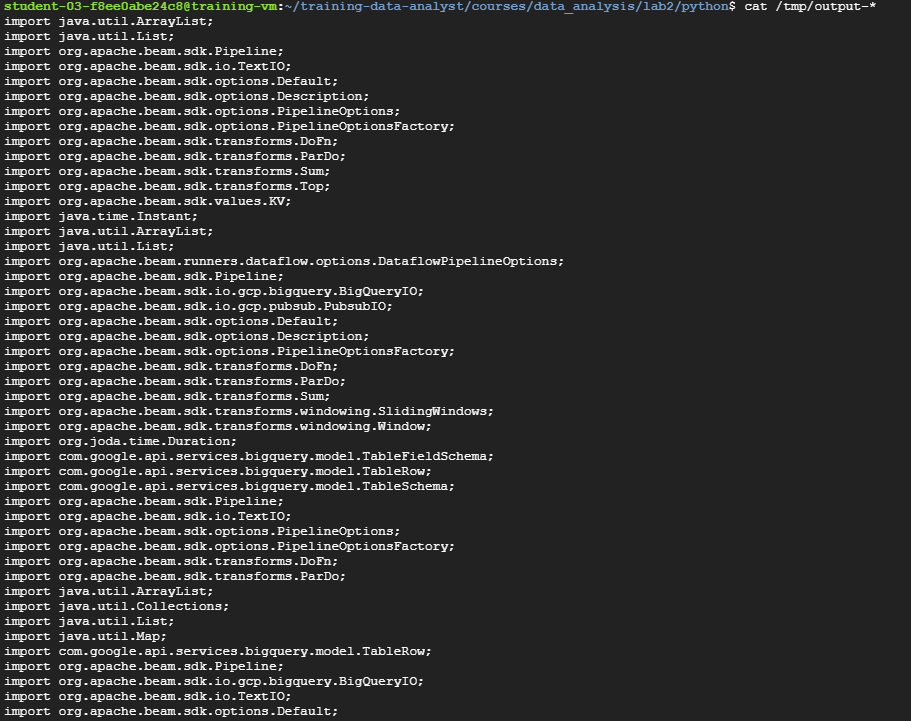
  
¿El resultado parece lógico?

## Tarea 5. Ejecutar el pipeline en la nube

- Copia algunos archivos Java a la nube.

     En la terminal SSH de la máquina virtual de entrenamiento , introduce el siguiente comando:


    ```sh
    # Este comando copia todos los archivos .java que están en la ruta local ../javahelp/.../javahelp/* hacia el bucket de Cloud Storage llamado $BUCKET, dentro de la carpeta/prefijo `javahelp`.
    
    gcloud storage cp ../javahelp/src/main/java/com/google/cloud/training/dataanalyst/javahelp/*.java gs://$BUCKET/javahelp

    ```

    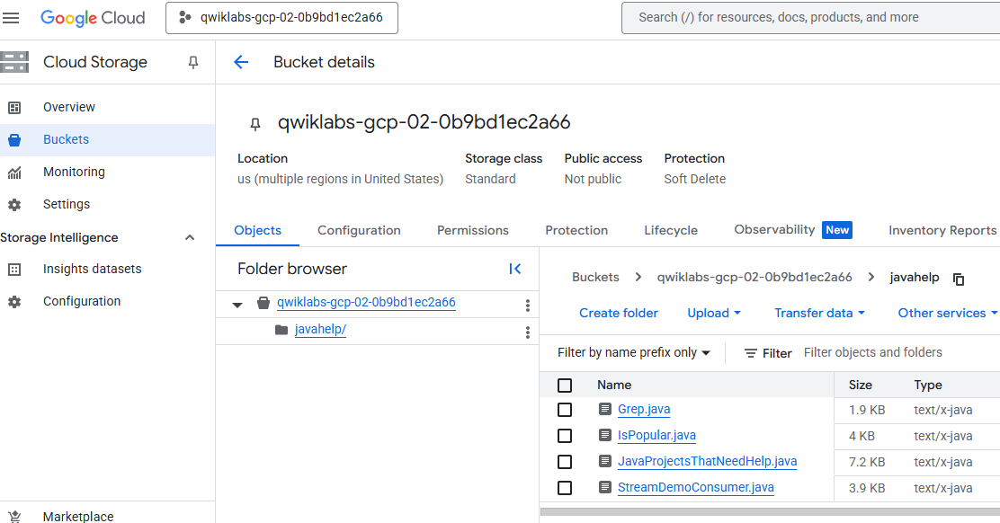
  
- Usando `nano`, edite la canalización de flujo de datos en `grepc.py`:

    ```sh
    # Editamos el archivo grey.py 
    nano grepc.py
    ```
    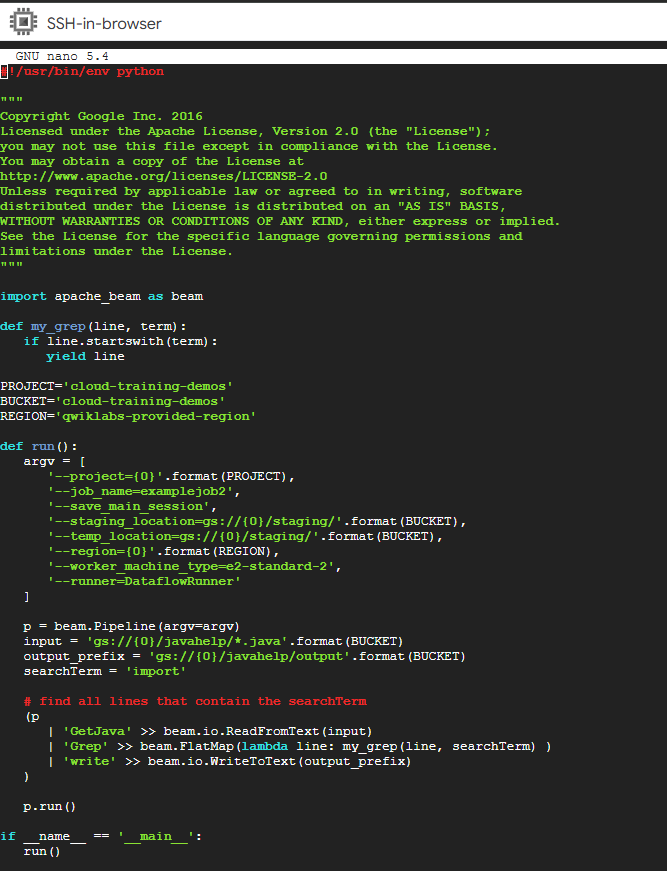
  
- Reemplace PROJECT, BUCKET y REGION con los valores que se indican a continuación. Conserve las comillas simples exteriores.

    ```sh
    PROJECT='PROJECT ID'
    ```

    ```sh
    BUCKET='PROJECT ID'
    ```

    ```sh
    REGION='REGION'
    ```
Guarde el archivo y cierre `nano` presionando la tecla **CTRL+X**, luego escriba **Y** y presione **Enter**.

- Envíe el trabajo de Dataflow a la nube:
    ```sh
    # ejecutamos el script
    python3 grepc.py
    ```
Debido a que se trata de un trabajo tan pequeño, ejecutarlo en la nube tomará mucho más tiempo que ejecutarlo localmente (alrededor de 7 a 10 minutos).

- Regrese a la pestaña del navegador para ver la consola.

- En el **menú de navegación** , haga clic en **VER TODOS LOS PRODUCTOS** . En la sección **Análisis** , haga clic en **Dataflow** y seleccione su trabajo para supervisar el progreso.

- Espere hasta que el **Job status** sea **Exitoso** .
    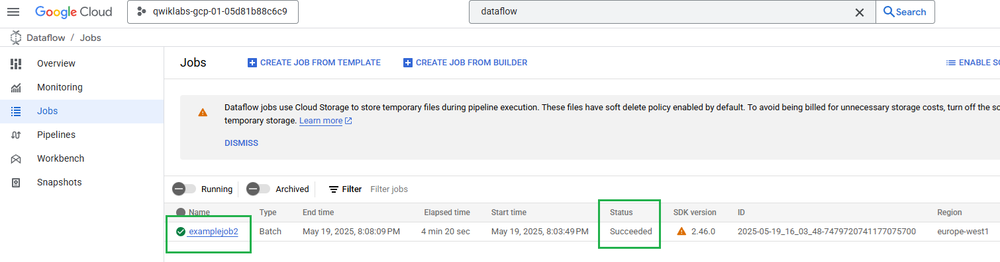
    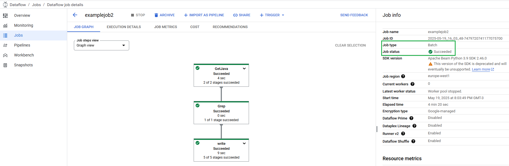


- En el **menú de Navegación** , haga clic en **Cloud Storage > Buckets**.

- Haga clic en el directorio **javahelp** .

    Este trabajo genera el archivo `output.txt`.

    Si el archivo es lo suficientemente grande, se fragmentará en varias partes con nombres como: output-0000x-of-000y. Puede identificar el archivo más reciente por su nombre o por el campo **Last modified**.
    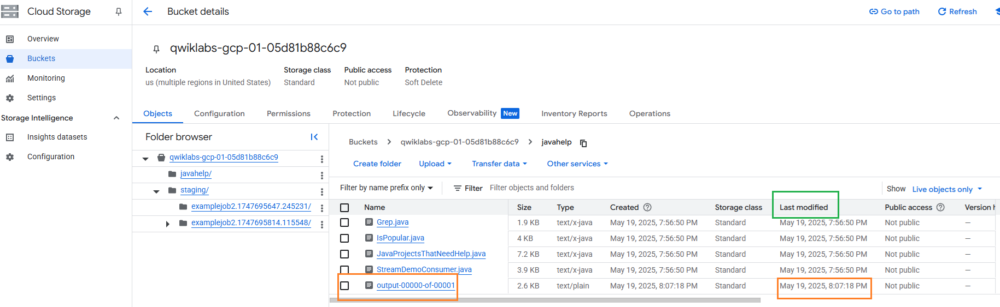

- Haga clic en el archivo para verlo.

    Alternativamente, puede descargar el archivo a través de la terminal SSH de `training-vm` y verlo:

    ```
    gcloud storage cp gs://$BUCKET/javahelp/output* .
    cat output*
    ```


    #### ARCHIVO OUTPUT

    ```
    import org.apache.beam.sdk.Pipeline;
    import org.apache.beam.sdk.io.TextIO;
    import org.apache.beam.sdk.options.PipelineOptions;
    import org.apache.beam.sdk.options.PipelineOptionsFactory;
    import org.apache.beam.sdk.transforms.DoFn;
    import org.apache.beam.sdk.transforms.ParDo;
    import java.util.ArrayList;
    import java.util.List;
    import org.apache.beam.sdk.Pipeline;
    import org.apache.beam.sdk.io.TextIO;
    import org.apache.beam.sdk.options.Default;
    import org.apache.beam.sdk.options.Description;
    import org.apache.beam.sdk.options.PipelineOptions;
    import org.apache.beam.sdk.options.PipelineOptionsFactory;
    import org.apache.beam.sdk.transforms.DoFn;
    import org.apache.beam.sdk.transforms.ParDo;
    import org.apache.beam.sdk.transforms.Sum;
    import org.apache.beam.sdk.transforms.Top;
    import org.apache.beam.sdk.values.KV;
    import java.util.ArrayList;
    import java.util.Collections;
    import java.util.List;
    import java.util.Map;
    import com.google.api.services.bigquery.model.TableRow;
    import org.apache.beam.sdk.Pipeline;
    import org.apache.beam.sdk.io.gcp.bigquery.BigQueryIO;
    import org.apache.beam.sdk.io.TextIO;
    import org.apache.beam.sdk.options.Default;
    import org.apache.beam.sdk.options.Description;
    import org.apache.beam.sdk.options.PipelineOptions;
    import org.apache.beam.sdk.options.PipelineOptionsFactory;
    import org.apache.beam.sdk.transforms.DoFn;
    import org.apache.beam.sdk.transforms.ParDo;
    import org.apache.beam.sdk.transforms.Sum;
    import org.apache.beam.sdk.transforms.Top;
    import org.apache.beam.sdk.transforms.View;
    import org.apache.beam.sdk.values.KV;
    import org.apache.beam.sdk.values.PCollection;
    import org.apache.beam.sdk.values.PCollectionView;
    import java.time.Instant;
    import java.util.ArrayList;
    import java.util.List;
    import org.apache.beam.runners.dataflow.options.DataflowPipelineOptions;
    import org.apache.beam.sdk.Pipeline;
    import org.apache.beam.sdk.io.gcp.bigquery.BigQueryIO;
    import org.apache.beam.sdk.io.gcp.pubsub.PubsubIO;
    import org.apache.beam.sdk.options.Default;
    import org.apache.beam.sdk.options.Description;
    import org.apache.beam.sdk.options.PipelineOptionsFactory;
    import org.apache.beam.sdk.transforms.DoFn;
    import org.apache.beam.sdk.transforms.ParDo;
    import org.apache.beam.sdk.transforms.Sum;
    import org.apache.beam.sdk.transforms.windowing.SlidingWindows;
    import org.apache.beam.sdk.transforms.windowing.Window;
    import org.joda.time.Duration;
    import com.google.api.services.bigquery.model.TableFieldSchema;
    import com.google.api.services.bigquery.model.TableRow;
    import com.google.api.services.bigquery.model.TableSchema;

    ```
# Resumen del laboratorio

    
- Accedes a una VM para trabajar en un entorno ya listo para programar con Apache Beam.


- Clonás el repositorio con el código de ejemplo.

- Creás un bucket en Cloud Storage, que será usado por Dataflow para staging y output.

- Ejecutás el pipeline localmente con DirectRunner, ideal para pruebas.

- Ejecutás el pipeline en la nube con DataflowRunner, usando el bucket para staging/output.


